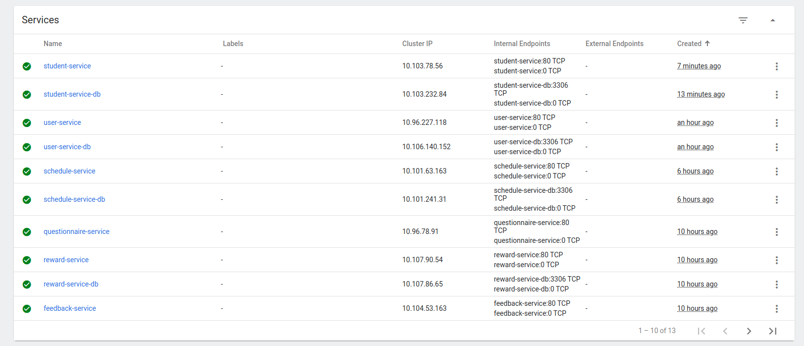
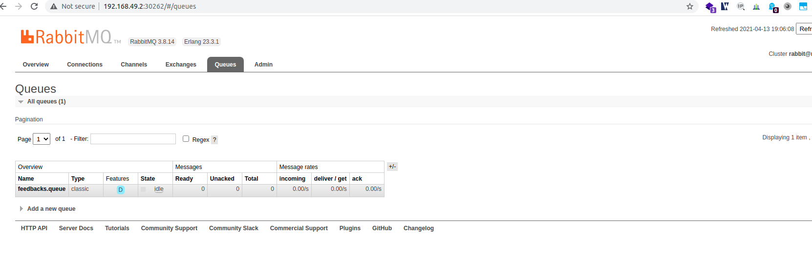
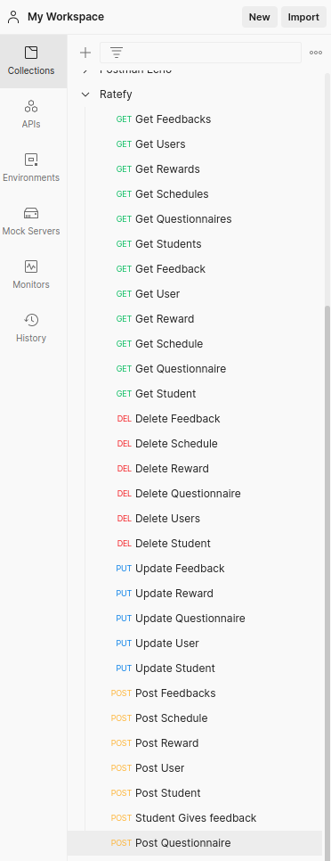
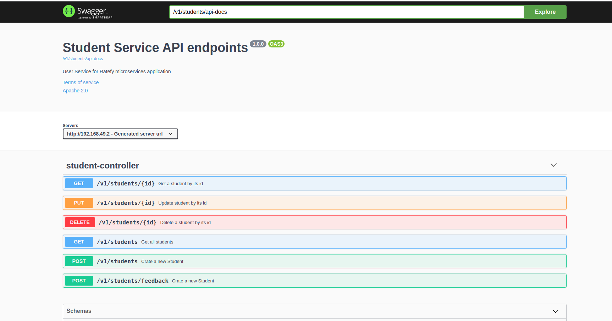

# UT_ServiceOrientedArchitecture

This the repository of Ratefy microservices web API. A feedback application by students for students at the University 
of Twente. This is a project for the course Service-oriented Architecture Web Serv. (2020-2A).

**The Feedback Service (feedback-service) will be used as an example service when needed.**

## Requirements
* Docker version 20.10.6 or higher
* Minikube version: v1.19.0 or higher
* Ingress controller enabled on Minikube using `minikube addons enable ingress`
* Postman client to be able to call the endpoints and test the application. To be able to fully test the endpoints, the
hostname ratefy.dev is used. `xxx.xxx.xxx.xxx   ratefy.dev` must be added to the hosts file on the local machine.
  The xxx.xxx.xxx.xxx is the ip address of the minikube cluster which can be obtained from the command line by executing 
  `minikube ip`. Using Swagger instead of Postman is also an option :) .

The project consists of the following services:
* Feedback Service
* Questionnaire Service
* Reward Service
* Schedule Service
* User Service
* Student Service
* RabbitMQ service for managing the asynchronous communication between the student-service and the feedback-service.

Each service has its own directory, and each service has the following component:
* The java + spring boot source code
* A `docker-compose.yaml` file which is responsible for setting up a mysql database container + [adminer]
  (https://www.adminer.org/)
* A Dockerfile.yaml. This file could be used to generate a base docker image for each service. The following command 
could be used to generate an image for the feedback-service: `docker build -t feedback-service-image . `
* A kube folder which contains yaml files needed to get the service up and running on a Kubernetes cluster:
    * **~~external-database.yaml~~**: this file is responsible for creating an external database service to connect the 
      service inside Kubernetes with the database container (which is created as a result of the docker-compose up 
      command) on the host machine. **This file must not be used. You can ignore it. It's included for teaching and 
      referencing purposes.** Unfortunately, we couldn't get this working. We chose to host the database inside Kubernetes. 
    * **feedback-database.yaml**: This file can be used to create a deployment + service + persistent volume and
      PersistentVolumeClaim for the service inside Kubernetes. The databases are also managed inside Kubernetes. The 
      database services are named as follows: SERVICENAME-service-db. For feedback-service-db
    * **feedback-secrets.yaml**: This file includes the secrets needed for the database. All values are base64 encoded.
    * **feedback-service.yaml**: This file is responsible to create deployment + service + pod for the service. All services are named
    as follows: SERVICENAME-service. For example, feedback-service. We have chosen for this approach to make managing 
      easier and to make the service naming consistent.
      
  Only the feedback-service folder contain one extra`.yaml` file which is `ratefy-gateway.yaml`. This file is responsible
for creating the ingress gateway to be able to reach all services on the cluster.

It's highly recommended to create the secrets of the service, then the database-service and at the end the actual service.
Services/deployment could be created either from the dashboard of Minikube `minikube dashboard` or by executing the 
following command from the command-line:

* `kubectl apply -f feedback-secrets.yaml`
* `kubectl apply -f feedback-database.yaml`
* `kubectl apply -f feedback-service.yaml`

Two things must be done first:
* The gateway:
Don't forget create the ratefy-gateway. Within the folder of feedback-service/kube 
`kubectl apply -f ratefy-gateway.yaml`
  
* The RabbitMQ from rabbitMQ folder
  `kubectl apply -f mq-config.yaml` and `mq-deployment.yaml`

### Kubernetes (minikube) dashboard
Here is a screenshot of Minikube dashboard with all running services inside. All services run smoothly without any error.

### RabbitMQ dashboard
The rabbitmq-service has type NodPort which means it's accessible using the ip-address of the cluster with the assigned
port. Execute the following command from the command-line to reveal which port is assigned to the rabbitmq dashboard.
`kubectl -n default get svc`.

### Postman collection
Please use the file `Ratefy.postman_collection.json` to import all endpoints.
This collection contains all endpoints of Ratefy including the health-check endpoints per service. 

### Swagger ui
Each service has also a swagger ui. It can be accessed by using the ip-address of the minikube cluster, or the domain
ratefy.dev if you have already added it to your hosts file.
http://192.168.49.2/v1/feedbacks/swagger-ui/index.html?configUrl=/v1/feedbacks/api-docs/swagger-config#/ .

**Note** we have used feedbacks (plural). For student service, you have to use students and so on.
